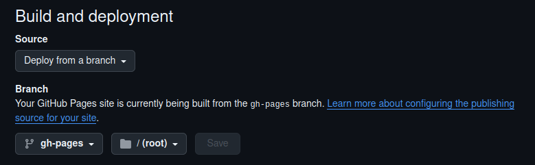

# UMA mkdocs template

This is [the University of Málaga](https://www.uma.es) template to create  mkdocs websites.

By [Juan M. Gandarias](https://jmgandarias.com) 

Systems Engineering and Automation Department

## Create your own material website

If you want to create your own website, you need to do the following:

1. Clone/fork [the repo](https://github.com/jmgandarias/mkdoc_UMA_template)
2. Install mkdocs and the required plugins

    ```bash
    pip install mkdocs
    pip install mkdocs-material
    pip install mkdocs-awesome-pages-plugin
    pip install mkdocs-git-revision-date-localized-plugin
    pip install mkdocs-redirects
    pip install mkdocs-video
    ```

3. See the changes locally

    ```bash
    mkdocs serve
    ```

4. Deploy your website

    You should change the *mkdocs.yml* file with your repo name and website URL. 
    Then, don't forget to change the *Settings* of your repo:

    - Go to Settings > Pages
    - In the section *Build and deployment* select *Source: Deploy from a branch*
    - In the section *Branch* select *gh-pages* and */root*

    

## Torubleshooting

### WSL

> [!WARNING]  
> If you want to install it in WSL, you'll probably receive a <span style="color:orange">**_WARNING_**</span> displaying that the directory `YOUR_USER_DIRECTORY/.local/bin` is not included in the PATH. 
> If this happen, you won't be able to run mkdocs serve to see the changes locally. To solve that, you need to modify your `.bashrc` file as follows
> ```bash
> cd ~/
> sudo gedit .bashrc
> ```
> Add the following line to the end of the file:
> `export PATH="YOUR_USER_DIRECTORY/.local/bin:$PATH"`

### Jinja2

> [!CAUTION]  
> If, after installing the required plugins correctly, you receive an <span style="color:red">**_ERROR_**</span> about *Jinja2* (something like ```jinja2.exceptions.TemplateAssertionError: No filter named 'items'```) when running ```mmkdocs serve``` you'll need to upgrade *jinja2* running the following command:
>  ```bash
> sudo pip install --upgrade jinja2
> ```